# 🌾 Smart Agriculture Monitoring System - SIH 2025

[](https://sih.gov.in/)
[]()
[](https://python.org)
[](https://mathworks.com)
[](LICENSE)

## 🎯 **Project Vision**

**Revolutionizing Agriculture through Intelligent Monitoring**

Our Smart Agriculture Monitoring System leverages cutting-edge **IoT sensors**, **AI/ML models**, **hyperspectral imaging**, and **real-time analytics** to empower farmers with data-driven insights for optimizing crop health, water usage, and agricultural productivity.

### **🏆 Competition Goals**
- **Problem Solving**: Address critical agricultural challenges in India
- **Innovation**: Integrate multiple advanced technologies seamlessly
- **Impact**: Demonstrable benefits for farmers and food security
- **Scalability**: Solution deployable across diverse agricultural contexts
- **Sustainability**: Environmentally conscious and economically viable

---

## 👥 **Team Structure & Expert Responsibilities**

### **🎨 Frontend Team - User Experience & Presentation**
**👤 Arnav Sharma** - *Frontend Developer*  
**👤 Radhika Patel** - *UI/UX Designer & Presentation Specialist*

- **Streamlit Dashboard**: Interactive web-based monitoring interface
- **Data Visualization**: Real-time charts, maps, and analytics displays  
- **User Experience**: Farmer-friendly interface design and usability
- **Presentation Materials**: SIH competition presentations and demos
- **📖 Documentation**: [`frontend/README.md`](frontend/README.md) | [`frontend/assets/README.md`](frontend/assets/README.md)

### **🔧 Backend Team - System Integration & Orchestration** 
**👤 Suryansh Kumar** - *Backend Developer & System Architect*

- **MATLAB Integration**: Core analysis functions and data processing
- **System Orchestration**: Coordinate IoT, AI, and frontend components
- **API Development**: Create interfaces between system components
- **Performance Optimization**: Ensure efficient real-time operation
- **📖 Documentation**: [`backend/README.md`](backend/README.md)

### **🧠 AI/ML Team - Intelligent Analytics**
**👤 Aryan Singh** - *AI/ML Engineer*

- **Computer Vision**: Hyperspectral image analysis for crop health assessment
- **Deep Learning**: CNN and LSTM models for prediction and classification
- **Predictive Analytics**: Crop stress prediction and yield forecasting
- **Alert Intelligence**: Smart alerting system with confidence scoring
- **📖 Documentation**: [`ai/README_ENHANCED.md`](ai/README_ENHANCED.md)

### **📊 Data Team - Data Engineering & Quality**
**👤 Neha Gupta** - *Data Engineer*

- **Data Pipeline**: ETL processes for multi-source data integration
- **Data Quality**: Cleaning, validation, and quality assurance systems
- **Feature Engineering**: Transform raw data into ML-ready formats
- **Data Management**: Storage, versioning, and accessibility optimization
- **📖 Documentation**: [`data/README.md`](data/README.md)

### **📡 IoT Team - Hardware Integration & Sensors**
**👤 Harshit Malhotra** - *IoT Engineer*

- **Sensor Networks**: ESP32-based environmental monitoring devices
- **MQTT Communication**: Real-time data transmission and device management
- **Hardware Integration**: Multi-sensor data collection and calibration
- **Power Management**: Solar-powered field deployment optimization
- **📖 Documentation**: [`iot/README.md`](iot/README.md)

---

## 🏗️ **System Architecture - Enhanced React Integration**

```mermaid
graph TB
    subgraph "Field Layer"
        IoT[📡 IoT Sensors<br/>ESP32 Devices<br/>Multi-sensor Arrays]
        Drone[🚁 Hyperspectral<br/>Imaging<br/>MATLAB Analysis]
    end
    
    subgraph "Communication Layer"
        MQTT[📶 MQTT Broker<br/>Real-time Streaming<br/>Device Management]
        Forwarder[🔄 MQTT Forwarder<br/>Python Bridge<br/>Data Validation]
    end
    
    subgraph "API Layer - NEW"
        API[🌐 FastAPI Server<br/>RESTful Endpoints<br/>WebSocket Support]
        WS[⚡ WebSocket Hub<br/>Real-time Updates<br/>Event Broadcasting]
    end
    
    subgraph "Processing Layer"
        MATLAB[🧮 MATLAB Engine<br/>API-Integrated Analysis<br/>Enhanced Algorithms]
        AI[🧠 AI/ML Models<br/>CNN + LSTM<br/>Predictive Analytics]
        Data[📊 Data Pipeline<br/>Quality Assurance<br/>Historical Storage]
    end
    
    subgraph "Frontend Layer - UPGRADED"
        React[⚛️ React Dashboard<br/>TypeScript + MUI<br/>Real-time Charts]
        Streamlit[📊 Streamlit Dashboard<br/>Legacy Support<br/>Comparison Interface]
    end
    
    subgraph "User Layer"
        Farmer[👨‍🌾 Modern Interface<br/>Real-time Monitoring<br/>Mobile Responsive]
        Expert[👨‍🔬 Advanced Analytics<br/>Detailed Insights<br/>Export Capabilities]
    end
    
    IoT --> MQTT
    Drone --> MATLAB
    MQTT --> Forwarder
    Forwarder --> API
    API --> WS
    MATLAB --> API
    AI --> MATLAB
    Data --> API
    API --> React
    WS --> React
    API --> Streamlit
    React --> Farmer
    React --> Expert
    Streamlit --> Expert
```



---

## 📁 **Directory Structure & Navigation**

```
SIH-2025/                                    # 🏠 Project Root
├── 📋 README.md                            # This comprehensive guide
├── 🛠️ SETUP.md                            # Detailed setup instructions
├── 📊 INTEGRATION_COMPLETE.md              # System integration status
├── ⚙️ requirements.txt                     # Python dependencies
├── 🚀 start_dashboard.bat                  # Quick launch script
│
├── ⚛️ frontend-react/                     # Modern React Frontend (NEW)
│   ├── 📖 README.md                       # React setup and development guide
│   ├── 📦 package.json                    # Dependencies and build scripts
│   ├── 🔧 tsconfig.json                   # TypeScript configuration
│   ├── 🌐 public/                         # Static assets and HTML template
│   └── 📁 src/                            # React application source
│       ├── 📱 App.tsx                     # Main application component
│       ├── 📄 index.tsx                   # Application entry point
│       ├── 🧩 components/                 # Reusable UI components
│       │   ├── Layout.tsx                 # Navigation and layout
│       │   └── MetricCard.tsx             # Sensor data display cards
│       ├── 📊 pages/                      # Application pages
│       │   └── Dashboard.tsx              # Main dashboard page
│       ├── 🔗 contexts/                   # React context providers
│       │   └── WebSocketContext.tsx       # Real-time data management
│       ├── 🌐 services/                   # API integration
│       │   └── api.ts                     # HTTP client and API calls
│       └── 📝 types/                      # TypeScript definitions
│           └── index.ts                   # Application interfaces
│
├── 🌐 api/                                # Backend API Server (NEW)
│   ├── 🚀 app.py                          # FastAPI application
│   ├── 📦 requirements.txt                # Python dependencies
│   ├── 🔄 mqtt_data_forwarder.py          # MQTT to API bridge
│   └── 📋 API_SPEC.md → ../API_SPEC.md   # API documentation
│
├── 💻 frontend/                            # Legacy Streamlit Frontend
│   ├── 📖 README.md                       # Streamlit development guide
│   ├── 🎨 assets/                         # Design & Presentation Materials  
│   │   ├── 📖 README.md                   # Design system guide (Radhika)
│   │   ├── 🎨 branding/                   # Logos, colors, typography
│   │   ├── 🖼️ graphics/                   # Icons, illustrations
│   │   ├── 📊 presentations/              # SIH competition presentations
│   │   └── 🎥 videos/                     # Demo and tutorial videos
│   ├── ⚙️ .streamlit/                     # Streamlit configuration
│   ├── 📱 app.py                          # Basic dashboard
│   ├── 🚀 app_enhanced.py                 # Advanced dashboard
│   ├── 🔗 app_integrated.py               # Fully integrated dashboard
│   └── 🧮 agri_data_processor.py          # Data processing utilities
│
├── 🔧 backend/                             # Backend Development
│   ├── 📖 README.md                       # Backend integration guide (Suryansh)
│   ├── 🎯 run_main_analysis.m             # Core analysis orchestration
│   ├── 🔄 run_main_analysis_enhanced.m    # Enhanced with real data
│   ├── 📡 run_main_analysis_iot.m         # IoT-integrated version
│   ├── 🌐 run_main_analysis_api_integrated.m # API-integrated version (LATEST)
│   ├── 🔗 ai_integration_layer.m          # AI model interfaces
│   ├── 📶 mqtt_listener.m                 # MQTT data reception
│   ├── 🧪 test_backend.m                  # Backend testing suite
│   └── 📁 stubs/                          # Development stubs and fallbacks
│
├── 🧠 ai/                                  # AI/ML Development
│   ├── 📖 README_ENHANCED.md              # Comprehensive AI guide (Aryan)
│   ├── 🔬 analyze_hyperspectral.m         # Hyperspectral image analysis
│   ├── 🖼️ analyze_image.m                 # CNN-based image classification
│   ├── 📈 predict_stress.m                # LSTM stress prediction
│   ├── 🚨 generate_alert.m                # Intelligent alert generation
│   ├── 📊 process_sensor_data.m           # Sensor data preprocessing
│   ├── 🎪 demo_ai_functions.m             # Complete system demonstration
│   └── 💾 models/                         # Trained model storage
│       ├── 📖 README.md                   # Model documentation
│       ├── 🧠 hyperspectral_cnn_model.mat # CNN for image analysis
│       └── 🔮 sensor_lstm_model.mat       # LSTM for predictions
│
├── 📊 data/                               # Data Management
│   ├── 📖 README.md                       # Data engineering guide (Neha)
│   ├── 📈 simulated_sensors.csv           # Generated sensor data (72h)
│   ├── 📁 raw/                            # Original datasets
│   │   ├── 📖 README.md                   # Raw data documentation
│   │   ├── 🛰️ Indian_pines.mat           # Hyperspectral dataset
│   │   ├── ✨ Indian_pines_corrected.mat  # Corrected hyperspectral
│   │   ├── 🏷️ Indian_pines_gt.mat         # Ground truth labels
│   │   └── 🌿 SalinasA.mat                # Additional hyperspectral data
│   ├── 🧹 processed/                      # Cleaned & processed data
│   ├── 🔄 interim/                        # Intermediate processing results
│   └── 📜 scripts/                        # Data processing pipelines
│
├── 📡 iot/                                # IoT Development  
│   ├── 📖 README.md                       # IoT integration guide (Harshit)
│   ├── 🔌 agricultural_sensor_device.ino  # Main ESP32 device code
│   ├── 🎛️ main_device_code.ino           # Alternative implementation
│   ├── 🐍 mqtt_data_manager.py           # Python MQTT data handler
│   └── ⚙️ device_configs/                # Configuration files
│
├── 🔬 test_integrated_system.py          # Complete system testing
├── 📋 matlab_engine_test.py              # MATLAB engine verification
└── 🗂️ Documentation Files                 # Additional guides and specs
    ├── 🔧 MATLAB_Engine_Guide.md         # MATLAB-Python integration
    └── 📶 IOT_MQTT_INTEGRATION_GUIDE.md  # MQTT setup and configuration
```

---

## 🚀 **Quick Start Guide**

### **🎯 For Judges & Evaluators**

#### **Option 1: Modern React Dashboard (Recommended)**
```bash
# Clone and launch the new React frontend
git clone <repository-url>
cd SIH-2025

# Start the API server
cd api
pip install -r requirements.txt
python app.py

# In a new terminal, start React frontend
cd frontend-react
npm install
npm start
```

🌐 **API Server**: http://localhost:8000  
⚛️ **React Dashboard**: http://localhost:3000  
🎠 **Features**: Real-time WebSocket updates, modern UI, mobile-responsive

#### **Option 2: Legacy Streamlit Dashboard**
```bash
# Traditional Streamlit interface
streamlit run frontend/app_integrated.py
```

📊 **Streamlit Dashboard**: http://localhost:8501  
🎠 **Features**: MATLAB integration, basic real-time updates

#### **Option 2: Full System Testing**
```bash
# Test complete integrated system
python test_integrated_system.py

# Run MATLAB integration tests (requires MATLAB)
matlab -batch "run_main_analysis_iot"
```

### **👨‍💻 For Development Team**

#### **Environment Setup**
```bash
# 1. Python environment
python -m venv agri_dashboard_env
agri_dashboard_env\Scripts\activate  # Windows
# OR
source agri_dashboard_env/bin/activate  # Linux/Mac

# 2. Install dependencies  
pip install -r requirements.txt

# 3. Verify MATLAB Engine (if available)
python matlab_engine_test.py
```

#### **Development Workflow**
```bash
# 1. Create feature branch
git checkout -b [your-name]/[feature-name]

# 2. Work in your designated directory
# - Arnav & Radhika: frontend/
# - Suryansh: backend/
# - Aryan: ai/
# - Neha: data/
# - Harshit: iot/

# 3. Test your changes
python test_integrated_system.py

# 4. Commit and push
git add .
git commit -m "[component]: descriptive commit message"
git push origin [your-name]/[feature-name]
```

### **🎭 Available Dashboards**

| Dashboard | Technology | Launch Command | Features |
|-----------|------------|----------------|----------|
| **React Dashboard** 🌟 | React + TypeScript | `npm start` (in frontend-react/) | Modern UI, real-time WebSocket, mobile-responsive |
| **Streamlit Integrated** | Python | `streamlit run frontend/app_integrated.py` | MATLAB integration, IoT data, alerts |
| **Streamlit Enhanced** | Python | `streamlit run frontend/app_enhanced.py` | Real-time updates, advanced analytics |
| **Streamlit Basic** | Python | `streamlit run frontend/app.py` | Simple UI, basic charts |

---

## 🛠️ **Technology Stack**

### **⚛️ React Frontend (Primary)**
- **React 18**: Modern frontend framework with hooks
- **TypeScript**: Type-safe development and better IDE support
- **Material-UI (MUI)**: Professional React component library
- **Recharts**: Data visualization and charting
- **React Query**: Server state management and caching
- **Socket.IO**: Real-time WebSocket communication
- **Axios**: HTTP client for API integration

### **🌐 API Layer (FastAPI)**
- **FastAPI**: High-performance Python web framework
- **WebSockets**: Real-time bidirectional communication
- **Pydantic**: Data validation and serialization
- **Uvicorn**: ASGI server for production deployment

### **🐍 Python Ecosystem**
- **Streamlit**: Legacy dashboard framework (maintained)
- **Pandas & NumPy**: Data manipulation and numerical computing
- **Matplotlib & Plotly**: Advanced data visualization
- **Scikit-learn**: Machine learning preprocessing
- **MQTT & JSON**: IoT communication protocols

### **📊 MATLAB Environment**
- **Deep Learning Toolbox**: CNN and LSTM model development
- **Image Processing Toolbox**: Hyperspectral image analysis
- **Signal Processing**: Sensor data filtering and analysis
- **Statistics Toolbox**: Advanced analytics and modeling

### **🔌 IoT & Hardware**
- **ESP32**: Microcontroller for sensor nodes
- **MQTT**: Real-time sensor data transmission
- **WiFi**: Wireless network communication
- **Multi-sensor Arrays**: Environmental monitoring

### **☁️ Data & Integration**
- **SQLite**: Local data storage and management
- **JSON**: Standardized data interchange format
- **CSV**: Tabular data processing
- **MAT Files**: MATLAB data storage

---

## 📊 **Current System Status**

### **✅ Completed Components**

| Component | Status | Description | Responsible |
|-----------|--------|-------------|--------------|
| 🎨 **Frontend Dashboard** | ✅ Complete | Interactive Streamlit interface with real-time monitoring | Arnav & Radhika |
| 🧠 **AI Models** | ✅ Operational | CNN image analysis + LSTM prediction models | Aryan |
| 📊 **Data Pipeline** | ✅ Ready | ETL processing with quality assurance | Neha |
| 🔧 **Backend Integration** | ✅ Functional | MATLAB orchestration with IoT integration | Suryansh |
| 📡 **IoT Framework** | ✅ Deployed | ESP32 sensor nodes with MQTT communication | Harshit |
| 🛰️ **Hyperspectral Data** | ✅ Available | Indian Pines dataset integrated and processed | Team |
| 📈 **Simulated Sensors** | ✅ Generated | 72-hour realistic sensor data simulation | System |
| 🎯 **System Testing** | ✅ Implemented | Complete integration testing framework | Team |

### **🔄 Integration Status**


---

## 🏆 **Competition Readiness**

### **📋 SIH 2025 Deliverables Checklist**

#### **✅ Technical Implementation**
- [x] **Working Prototype**: Complete end-to-end system demonstration
- [x] **AI/ML Integration**: Trained models with real performance metrics
- [x] **IoT Connectivity**: Real-time sensor data collection and transmission
- [x] **Data Processing**: Automated pipeline with quality assurance
- [x] **User Interface**: Professional, intuitive dashboard
- [x] **System Integration**: All components working together seamlessly
- [x] **Testing Framework**: Comprehensive testing and validation

#### **📚 Documentation & Presentation**
- [x] **Technical Documentation**: Comprehensive guides for each component
- [x] **System Architecture**: Clear diagrams and specifications
- [x] **User Manual**: End-user guides and tutorials
- [x] **API Documentation**: Integration specifications
- [x] **Presentation Materials**: SIH competition presentations ready
- [x] **Demo Scripts**: Rehearsed demonstration scenarios
- [x] **Video Content**: System demonstration videos

#### **🎯 Impact Metrics**
- **Accuracy**: >90% crop health prediction accuracy
- **Response Time**: <2 seconds for real-time alerts
- **Scalability**: Support for 100+ IoT devices per installation
- **User Experience**: <10 minutes learning curve for farmers
- **Cost Effectiveness**: <$500 per field monitoring setup
- **Environmental Impact**: 20-30% water usage optimization

### **🎪 Demonstration Scenarios**

1. **🌱 Real-time Monitoring**: Live sensor data visualization with AI insights
2. **🚨 Alert System**: Automated crop stress detection and farmer notifications  
3. **📈 Predictive Analytics**: Future condition forecasting with confidence intervals
4. **🎛️ Remote Management**: IoT device control and configuration
5. **📊 Historical Analysis**: Trend analysis and performance optimization
6. **🔄 Integration Flow**: Complete data flow from sensors to recommendations

---

## 🤝 **Team Coordination & Collaboration**

### **📅 Development Workflow**

#### **Daily Standup Structure**
- **📍 Progress Updates**: What was accomplished yesterday
- **🎯 Today's Goals**: Planned work and priorities
- **🚧 Blockers**: Issues requiring team assistance
- **🔗 Integration Points**: Cross-team dependencies and coordination

#### **Git Collaboration Standards**
```bash
# Branch naming convention
[name]/[component]/[feature]
# Examples:
arnav/frontend/dashboard-optimization
suryansh/backend/iot-integration  
aryan/ai/lstm-model-training

# Commit message format
[component]: [action] [description]
# Examples:
frontend: add real-time chart updates
backend: integrate MQTT data reception
ai: improve model accuracy to 94%
```

#### **Code Review Process**
1. **🔍 Self-Review**: Test locally before creating PR
2. **👥 Peer Review**: At least one team member review
3. **🧪 Integration Test**: Verify system-wide compatibility
4. **📋 Documentation**: Update relevant documentation
5. **✅ Approval**: Team lead approval before merge

### **🔗 Integration Contracts**

#### **Data Format Standards**
```json
{
  "sensor_data": {
    "device_id": "string",
    "timestamp": "ISO-8601",
    "measurements": {
      "temperature": "float (°C)",
      "humidity": "float (%)", 
      "soil_moisture": "float (%)",
      "ph_level": "float (0-14)",
      "light_intensity": "float (lux)"
    },
    "location": {
      "latitude": "float",
      "longitude": "float"
    },
    "quality_flags": {
      "data_quality_score": "float (0-1)"
    }
  }
}
```

#### **API Interface Specifications**
```python
# Backend → AI Interface
ai_result = analyze_hyperspectral(image_data)
stress_prediction = predict_plant_stress(sensor_history)
alert_message = generate_alert(health_map, predictions, current_stats)

# Backend → Frontend Interface  
dashboard_data = prepare_dashboard_data(processed_data)
real_time_update = get_latest_sensor_readings()
alert_notifications = get_active_alerts()

# IoT → Backend Interface
sensor_message = mqtt_client.subscribe("agri/sensors/+/data")
device_status = check_device_connectivity(device_id)
command_response = send_device_command(device_id, command)
```

---

## 🎯 **Success Metrics & KPIs**

### **🏆 Competition Success Criteria**
- **Technical Excellence**: Sophisticated, working system demonstration
- **Innovation Impact**: Novel application of AI/IoT in agriculture
- **User-Centric Design**: Intuitive interfaces for farmers
- **Scalability Potential**: Clear path to real-world deployment
- **Presentation Quality**: Professional, engaging demonstrations

### **📊 System Performance Targets**
- **Accuracy**: AI models >90% accuracy on crop health prediction
- **Latency**: <2 seconds for dashboard updates
- **Reliability**: >99% uptime for critical monitoring functions
- **Scalability**: Support 100+ concurrent IoT devices
- **Usability**: New users productive within 10 minutes

### **🌱 Agricultural Impact Goals**
- **Water Efficiency**: 20-30% reduction in irrigation water usage
- **Early Detection**: Identify crop stress 5-7 days earlier than visual inspection
- **Yield Optimization**: 10-15% improvement in crop yield through data-driven decisions
- **Cost Reduction**: 15-25% reduction in agricultural input costs
- **Sustainability**: Measurable reduction in pesticide and fertilizer usage

---

## 📞 **Support & Resources**

### **📚 Learning Resources**
- **📖 Team Documentation**: Comprehensive guides in each directory
- **🎥 Video Tutorials**: System demonstration and usage videos
- **📊 API References**: Complete integration specifications
- **🔧 Setup Guides**: Step-by-step installation instructions

### **🆘 Getting Help**
- **💬 Team Communication**: Daily standups and collaborative problem-solving
- **📋 Issue Tracking**: Document and prioritize technical challenges
- **🧪 Testing Support**: Comprehensive testing framework and validation
- **📖 Documentation**: Extensive guides for every system component

### **🔮 Future Enhancements**
- **📱 Mobile Application**: Native mobile app for farmers
- **🌐 Cloud Deployment**: Scalable cloud infrastructure
- **🤖 Advanced AI**: More sophisticated ML models and predictions
- **🛰️ Satellite Integration**: Remote sensing data integration
- **📊 Business Intelligence**: Advanced analytics and reporting

---

## 📄 **License & Acknowledgments**

### **📜 License**
This project is licensed under the MIT License - see the [LICENSE](LICENSE) file for details.

### **🙏 Acknowledgments**
- **Smart India Hackathon 2025** for providing the platform and challenge
- **Ministry of Agriculture & Farmers Welfare** for problem statement guidance
- **Open Source Community** for tools, libraries, and frameworks
- **Agricultural Experts** for domain knowledge and validation
- **Our Mentors** for guidance and technical review

---

**🌾 Transforming Agriculture Through Innovation | SIH 2025 | Team AgriTech Innovators 🚀**
